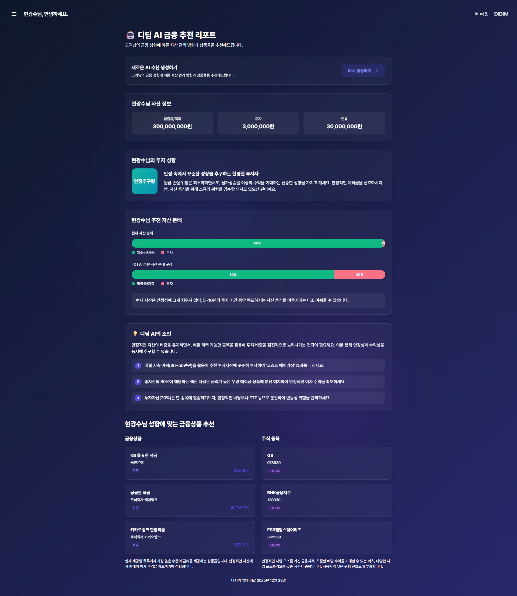
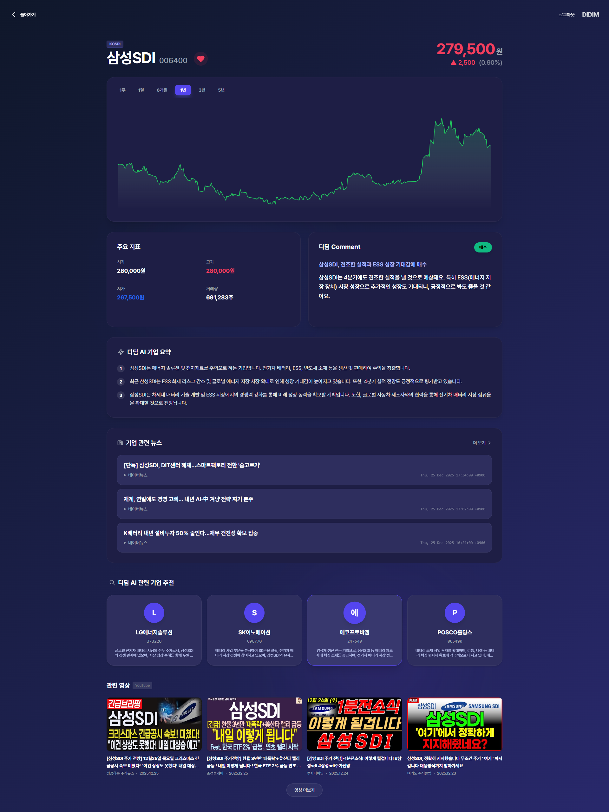
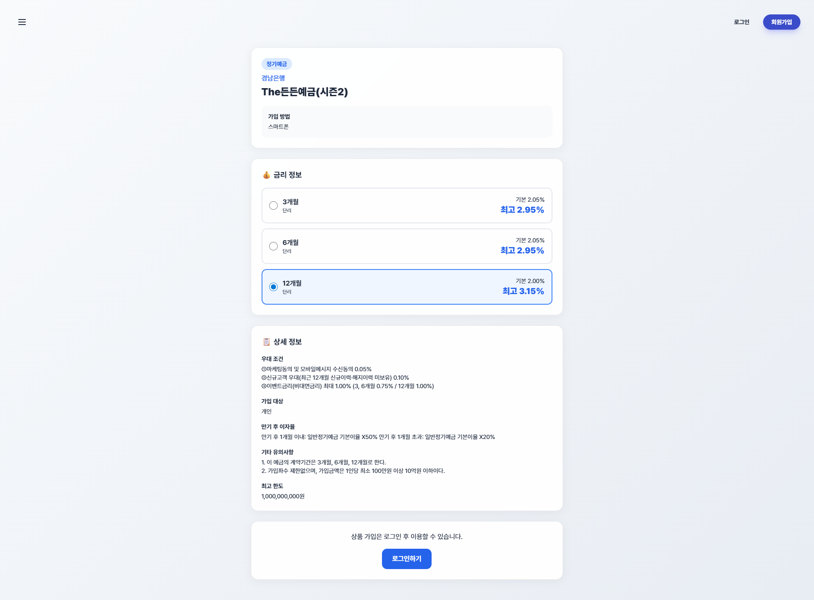
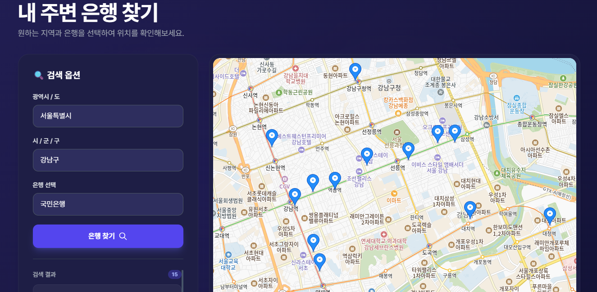
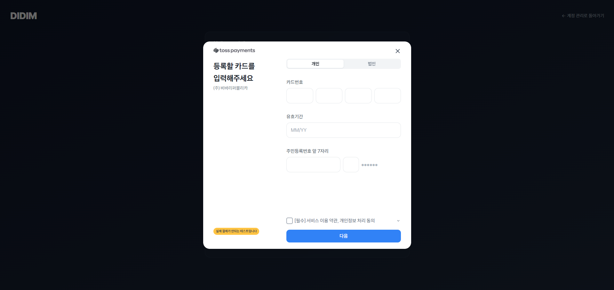
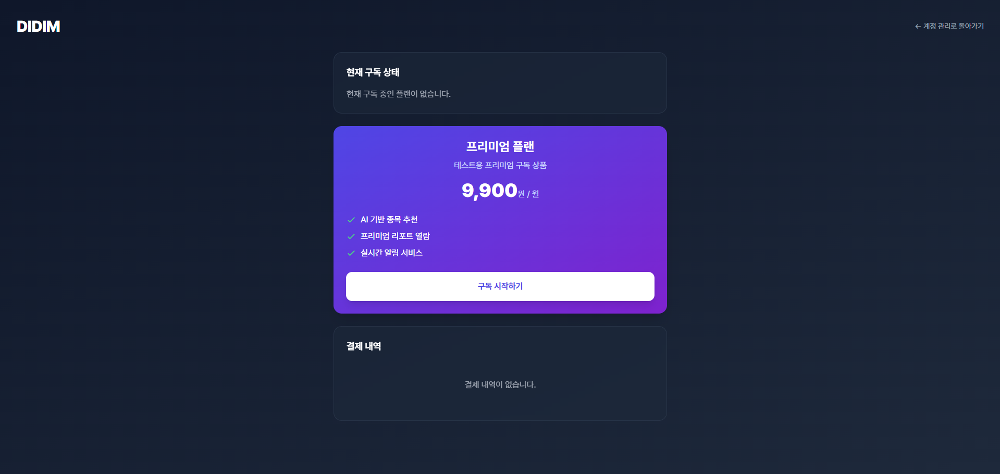
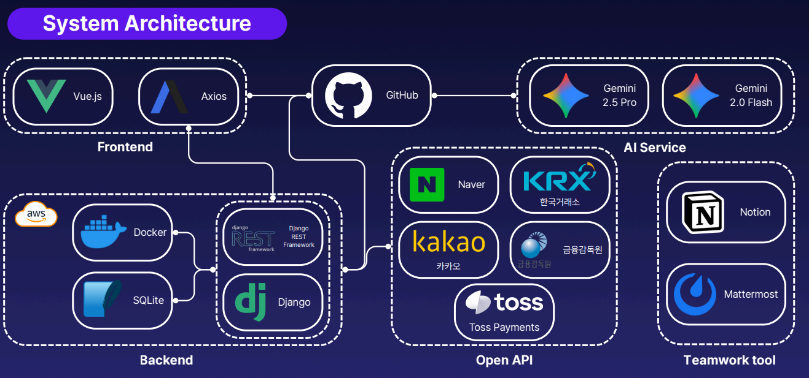
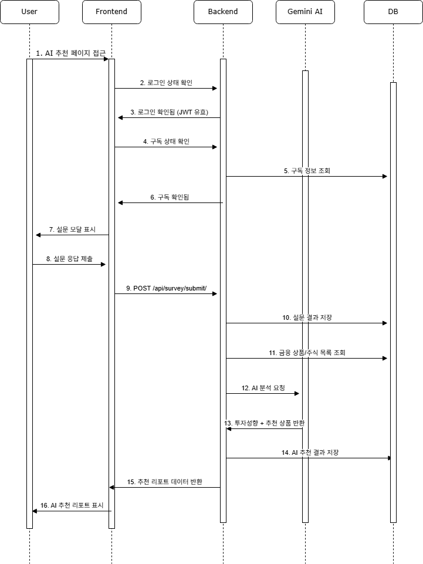

# 🏦 DIDIM (디딤) - 금융 생활의 든든한 디딤돌

> **금융 프로젝트**
>
> **개발 기간:** 2025.12.04 ~ 2025.12.25 (4주)

 

## 1. 프로젝트 개요

**"금융 초보자도 쉽게 자산 관리를 시작할 수 있는 디딤돌"**

**DIDIM**은 사용자의 자산 현황과 투자 성향을 분석하여 최적의 금융 상품(예적금, 주식, ETF)을 추천해주는 **AI 기반 올인원 자산 관리 플랫폼**입니다. 
복잡한 금융 데이터를 직관적으로 시각화하고, 생성형 AI(Gemini)를 통해 전문가 수준의 포트폴리오 리포트와 종목 분석 코멘트를 제공하여 성공적인 투자의 첫걸음을 지원합니다.

 

## 2. 팀원 정보 및 역할 분담

**Team DIDIM**

| 이름 | 역할 | 담당 업무 상세 |
| :--- | :--- | :--- |
| **현광수** | **팀장, Fullstack, Design** | • **Frontend**: Vue.js 3, Pinia 상태 관리, 컴포넌트 설계 및 구현 • **Design**: Figma 와이어프레임 제작 및 UI/UX 디자인 • **Feature**: 주식/ETF 차트 시각화(Chart.js), 종목 검색 및 상세 정보, 뉴스 크롤링 • **Deployment**: 프론트엔드/백엔드 AWS EC2 배포 및 최적화  • **DB**: ERD 설계, 금융감독원/한국거래소 데이터 수집 및 전처리  |
| **공재국** | **Backend, AI, API** | • **Backend**: Django REST Framework API 설계 및 구축 • **Feature**: 회원가입/인증(JWT, 소셜), 예적금 비교, 커뮤니티, 구독 결제(Toss) • **AI**: Gemini 프롬프트 엔지니어링, 추천 알고리즘 구현, 모델 이원화 설계|

 

## 3. 기술 스택 (Tech Stack)

### Backend

### Frontend

### AI & API

### Infra & Tools

 

## 4. 서비스 주요 기능

### 1) AI 금융 추천 리포트 (핵심 기능)

* **성향 진단:** 자산 규모, 연봉, 투자 기간, 위험 감내도 등을 설문으로 입력받습니다.
* **포트폴리오 제안:** Gemini 2.5 Pro가 사용자의 현재 자산 배분 상태를 분석하고, 이상적인 포트폴리오(예적금 vs 투자 비중)를 제안합니다.
* **구체적 상품 매칭:** 추상적인 조언이 아닌, **실제 가입 가능한 예적금 상품과 주식 종목(Ticker)**을 구체적으로 추천합니다.

### 2) AI 주식/ETF 심층 분석 (디딤 Comment)

* **실시간 뉴스 반영:** Google Search Tool을 연동하여 최근 1주일 내의 공시, 실적 발표, 시장 이슈를 실시간으로 반영합니다. (Hallucination 방지)
* **페르소나 이원화:**
    * **ETF:** 거시 경제 전문가 페르소나 (기초 지수, 섹터 트렌드 분석)
    * **개별 주식:** 기업 분석 전문가 페르소나 (매출/영업이익, 신사업, 모멘텀 분석)
* **투자의견 제시:** 매수/매도/관망 의견과 함께 3줄 핵심 요약을 제공합니다.

### 3) 금융 상품 검색 및 비교

* **통합 검색:** 금융감독원 API 기반으로 전국 은행의 예적금 상품을 한곳에서 비교합니다.
* **상세 필터링:** 은행별, 가입 기간별, 우대 금리 조건별로 원하는 상품을 빠르게 찾을 수 있습니다.
* **금리 시각화:** 기본 금리와 최고 우대 금리를 차트로 비교하여 실질적인 혜택을 보여줍니다.

### 4) 위치 기반 은행 찾기

* Kakao Map API를 활용하여 내 주변 또는 특정 지역의 은행 지점 위치를 지도에 표시합니다.

### 5) 구독 결제 시스템

* Toss Payments 연동을 통해 프리미엄 AI 기능을 위한 정기 구독 결제를 지원합니다.
* 빌링키(Billing Key) 발급 및 자동 결제 승인 로직을 구현했습니다.

 

## 5. 금융 상품 추천 알고리즘 (기술적 설명)

본 프로젝트의 추천 엔진은 **Rule-based 필터링**과 **LLM(Large Language Model)의 추론 능력**을 결합한 하이브리드 아키텍처입니다.

### 1) Multi-Modal Context Injection (환각 방지)
LLM이 존재하지 않는 상품을 추천하는 문제를 해결하기 위해, **DB에 저장된 실존하는 금융 상품 리스트(예적금 ID, 주식 Ticker)**를 프롬프트의 Context로 주입합니다. 이를 통해 AI는 "학습된 데이터"가 아닌 "주어신 데이터" 내에서 최적의 상품을 선택합니다.

### 2) AI Reasoning Engine (Gemini 2.5 Pro)
단순 매칭이 아닌 **CoT (Chain of Thought)** 기법을 적용하여 논리적인 추론을 수행합니다.
* **입력:** 사용자 설문 데이터 (나이, 자산, 성향) + 현재 자산 구성
* **추론:** "공격투자형이지만 예금 비중이 90%인 사용자" -> "급격한 변화보다는 ETF 비중을 10%씩 늘리는 단계적 접근 제안"
* **결과:** 개인화된 조언과 추천 상품 매핑

### 3) 정형 데이터 변환 (Structured Output)
생성형 AI의 텍스트 응답을 서비스 UI에 바인딩하기 위해, **Regex(정규표현식)**와 **JSON Parser**를 사용하여 비정형 텍스트를 정형 JSON 데이터로 실시간 변환합니다.

 

## 6. 생성형 AI 활용 내용

비용 효율성과 응답 속도 최적화를 위해 **모델 이원화 전략**을 채택했습니다.

| 구분 | 활용 모델 | 활용 내용 | 비고 |
| :--- | :--- | :--- | :--- |
| **심층 추천** | **Gemini 2.5 Pro** | 사용자 설문 기반 포트폴리오 구성, 자산 배분 논리 생성 | 높은 추론 능력 필요 |
| **실시간 분석** | **Gemini 2.0 Flash** | 개별 주식/ETF 뉴스 요약, 투자의견 도출 (Google Search 연동) | 빠른 속도, 최신성 중요 |
| **데이터 생성** | **Gemini** | 개발용 가상 사용자 더미 데이터, 커뮤니티 초기 게시글 생성 | 개발 생산성 향상 |
| **코드 개선** | **Copilot** | 복잡한 Django QuerySet 최적화, Vue 컴포넌트 리팩토링 | 개발 보조 |

 

## 7. 설계 문서 (Design Documents)

### 🏗️ ERD (Entity Relationship Diagram)
> *DB 설계 구조*
>  

### 🔄 System Architecture
> *전체 시스템 구조*
> 

### 📐 Sequence Diagram (핵심 로직)
> *AI 추천 리포트 생성 흐름*
> 

 

## 8. 프로젝트 후기 (Retrospective)

### 👨‍💻 현광수 (FE/Design)
> "Figma로 기획한 디자인을 Vue.js 코드로 100% 구현해내며 프론트엔드 개발의 즐거움을 느꼈습니다. 특히 Chart.js를 커스터마이징하여 주가 흐름과 금리 비교를 시각화하는 과정에서 사용자 경험(UX)의 중요성을 깨달았습니다. 방대한 금융 데이터를 사용자가 보기 편하게 렌더링하는 성능 최적화 부분에서 많은 배움을 얻었습니다."

### 👨‍💻 공재국 (BE/AI)
> "금융 프로젝트의 핵심인 '신뢰성'과 '최신성'을 확보하기 위해 노력했습니다. LLM 사용 시 발생하는 비용(토큰)과 속도 문제를 해결하기 위해 '모델 이원화'와 '결과 캐싱' 전략을 도입한 것이 기술적으로 가장 기억에 남습니다. 또한 Toss Payments와 소셜 로그인을 연동하며 실제 서비스 수준의 백엔드 로직을 경험할 수 있었습니다."

---
*Created by - Team DIDIM*
